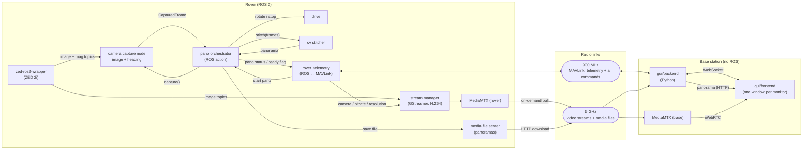

```mermaid
flowchart LR
    subgraph ROVER["Rover (ROS 2)"]
        ZED["zed-ros2-wrapper<br/>(ZED 2i)"]
        CAP["camera capture node<br/>image + heading"]
        ORCH["pano orchestrator<br/>(ROS action)"]
        DRIVE["drive"]
        STITCH["cv stitcher"]
        MEDIA["media file server<br/>(panoramas)"]
        SM["stream manager<br/>(GStreamer, H.264)"]
        RMTX["MediaMTX (rover)"]
        TELEM["rover_telemetry<br/>(ROS ↔ MAVLink)"]
    end

    subgraph LINKS["Radio links"]
        R900(["900 MHz<br/>MAVLink: telemetry + all commands"])
        R5G(["5 GHz<br/>video streams + media files"])
    end

    subgraph BASE["Base station (no ROS)"]
        BACK["gui/backend<br/>(Python)"]
        BMTX["MediaMTX (base)"]
        FRONT["gui/frontend<br/>(one window per monitor)"]
    end

    %% Camera data on the rover
    ZED -->|"image + mag topics"| CAP
    ZED -->|"image topics"| SM

    %% Panorama pipeline
    ORCH -->|"rotate / stop"| DRIVE
    ORCH -->|"capture()"| CAP
    CAP -->|"CapturedFrame"| ORCH
    ORCH -->|"stitch(frames)"| STITCH
    STITCH -->|"panorama"| ORCH
    ORCH -->|"save file"| MEDIA
    ORCH -->|"pano status / ready flag"| TELEM

    %% Video pipeline
    SM --> RMTX

    %% 900 MHz: telemetry and commands
    TELEM <--> R900
    R900 <--> BACK
    TELEM -->|"start pano"| ORCH
    TELEM -->|"camera / bitrate / resolution"| SM

    %% 5 GHz: video and media
    RMTX -->|"on-demand pull"| R5G
    R5G --> BMTX
    MEDIA -->|"HTTP download"| R5G
    R5G --> BACK

    %% Base station to browser
    BACK <-->|"WebSocket"| FRONT
    BACK -->|"panorama (HTTP)"| FRONT
    BMTX -->|"WebRTC"| FRONT
```